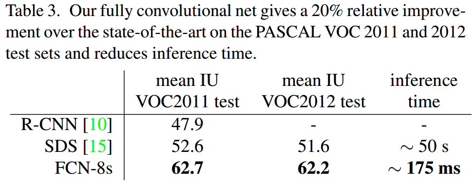

# FCN 
[原文链接在此](https://arxiv.org/pdf/1411.4038.pdf)
- [论文贡献](#论文贡献)
   - [全卷积层取代全连接层](#全卷积层取代全连接层)
   - [skip-architecture](#skip-architecture)
- [实验情况](#实验情况)
----------

----------
## 论文贡献
- #### 全卷积层取代全连接层
1. **全连接层**弊端：
   1. 输入图像尺寸维度固定
   2. 丢失了空间信息
2. **全卷积层**优势：
   1. 维度没有限制
   2. 保留了空间信息
   3. 参数与计算量同时大幅减少（无论是infer（前向传播）还是train（后向传播）时，速度快了5倍以上）
   4. 解决了全连接层没法用于pixel-wise tasks的困难
- #### skip-architecture
skip-architecture实际上就是一个decoder，将down-sampling后的feature maps放大至原图大小，以完成pixel-wise tasks。 
第一行是在pool-5后，也就是down-sampling了32倍后，将feature maps还原至原图大小。 
第三行是在down-sampling了8倍后，将feature maps还原至原图大小。（后面的论文称为**FCN-8s**，这样的配置性能最好） 
第二行和第三行这种操作：将下采样后的特征图上采样后，与下采样前的特征图进行conbining。操作后的特征图在一定程度上同时具有：全局及局部语义信息。

## 实验情况
- #### 实验细节
   1. 分类层初始化：0初始化要优于随机初始化，同时该层traning时采用dropout
   2. fine-tuning：全部网络进行fine-tuning相较于仅对分类层进行fine-tuning，性能会有较大提升
   3. 训练集：增加训练集，可以提升模型性能
   4. 图像随机裁剪后采样训练or整幅图像训练：两者训练结果性能没有太大差别，前者训练速度慢于后者
   5. 上采样方式：最后一层用插值法，其他层用deconvolution
   6. 上采样方式对比：对比了deconvolution和shift and stich，前者更简单有效
   7. 数据增强：通过镜像等方式进行数据增强，但模型性能没有明显提升
- #### 实验结果
   1. 将FCN-32s、FCN-16s及FCN-8s进行比较，发现down-sampling至8倍时，性能最好。
   
   2. 将FCN-8s与之前的一些算法进行比较，可以看到FCN-8s已经取得了截止发稿时的state of the art。
   
   3. 采样片（sampling patches）与整图（whole image）训练方式迭代次数差不多，但是run time相差较大。
   
